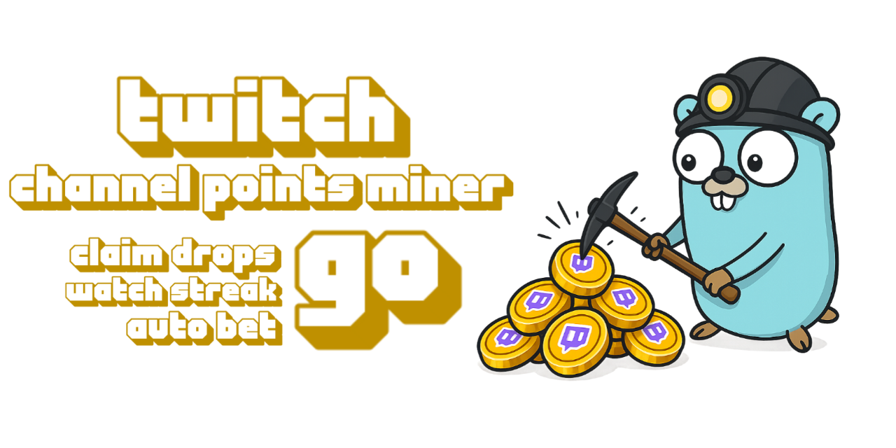

<p align="center">
<a href="https://github.com/0x8fv/Twitch-Channel-Points-Miner/releases"></a>
<a href="https://github.com/0x8fv/Twitch-Channel-Points-Miner/stargazers"></a>
<a href="https://github.com/MShawon/github-clone-count-badge"></a>
<a href="https://github.com/0x8fv/Twitch-Channel-Points-Miner"></a>
</p>

# Twitch Channel Points Miner (Go)

Go rewrite of [0x8fv/Twitch-Channel-Points-Miner-v2](https://github.com/0x8fv/Twitch-Channel-Points-Miner-v2) with a focus on speed and low overhead. This version keeps the same behavior (auto-claims bonuses, drops, and predictions) but trims dependencies, streams point updates over PubSub.

> Credits to the original maintained fork by [rdavydov](https://github.com/rdavydov/Twitch-Channel-Points-Miner-v2), whose work inspired this Go rewrite.

## Why this version
- Written in Go for faster start-up and lower CPU compared to the original runtime.
- Uses Twitch PubSub for near-instant point gain logging.
- Can target a manual list of streamers or mine everyone you follow.

## Quick start
1) Install Go 1.21+.
2) Copy `config.json` (it will be created/extended on first run) and set `username` plus any options you want. Leave the `streamers` array empty to mine all followed channels.
3) Run `go run .` (or `go build -o twitch-miner` and execute `./twitch-miner`).
4) On first launch you will see a device code prompt. Open `https://www.twitch.tv/activate`, enter the code, and wait until the app confirms login. Cookies are saved to `cookies/<username>.json` for future runs.
5) Press Ctrl+C to stop; a session summary is printed on exit.

## Configuration (config.json)
- `username`: Twitch login used for mining and for the cookie filename.
- `password`: Optional; device login is used, so you can leave this as-is.
- `smart_logging`, `emojis`, `show_seconds`, `show_username_in_console`, `show_claimed_bonus_msg`: Console output preferences.
- `save_logs`: Write console output to `log/<username>.log` in addition to stdout.
- `disable_ssl_cert_verification`: For environments with custom TLS interception; leave `false` unless you know you need it.
- `timezone`: Optional IANA timezone name (e.g. `Europe/Berlin`) to override auto-detection for environments like Android/Termux; leave `null`/empty to auto-detect.
- `claim_drops_startup`, `claim_drops`, `follow_raid`: Auto-claim drops at boot, continue claiming while running, and auto-follow raid targets.
- `betting(make_predictions)`: Enable Twitch prediction betting.
- `streamers`: List of channel logins to mine; if empty, followers are mined in descending follow order.
- `streamer_overrides`: Per-streamer overrides keyed by login; inherit from the global flags above. Example:
  ```json
  "streamer1": {
      "make_predictions": true,
      "follow_raid": false,
      "claim_drops": true,
      "claim_moments": false,
      "watch_streak": true,
      "community_goals": false,
      "bet": {
        "strategy": "SMART",
        "percentage": 5,
        "percentage_gap": 20,
        "max_points": 234,
        "minimum_points": 20000,
        "stealth_mode": true,
        "delay_mode": "FROM_END",
        "delay": 6
      }
    },
    "streamer2": {
      "make_predictions": false,
      "follow_raid": true,
      "claim_drops": false,
      "claim_moments": true,
      "watch_streak": false,
      "community_goals": true,
      "bet": {
        "strategy": "PERCENTAGE",
        "percentage": 10,
        "percentage_gap": 15,
        "max_points": 5000,
        "minimum_points": 0,
        "stealth_mode": false,
        "delay_mode": "FROM_START",
        "delay": 3
      }
    }
  }
  ```
- `show_game`: When true, log the game a streamer is playing on join and on watch-point gains.
- `game_priority` / `game_exclude`: Ordered game names to prefer and names to skip entirely. Leave empty to keep the default behavior; matches are case-insensitive.
- `bet`: Advanced prediction tuning. Defaults are applied when values are `null`:
  - `strategy`: Default `SMART` (see `entities.Strategy` for options such as `MOST_VOTED`, `HIGH_ODDS`, `SMART_MONEY`, etc.).
  - `percentage`: Percent of points to bet (default 5).
  - `percentage_gap`: Minimum edge between outcomes before betting (default 20).
  - `max_points`: Cap per bet (default 50000).
  - `minimum_points`: Skip bets below this balance (default 0).
  - `stealth_mode`: If true, bets favor lower-visibility patterns (default false).
  - `delay_mode` / `delay`: When to place the bet (default `FROM_END`, 6 seconds).

## How it works
- Authenticates via Twitch device flow, persists cookies per user, and refreshes the client build id for GQL calls.
- Loads channel points context to grab balances and blue chests; watches two live streams at a time for minute-watched events to keep streaks active.
- If you have an active subscription (multiplier) on a streamer, their name is highlighted in gold everywhere it appears in the logs so you can quickly spot priority channels.
- Listens to PubSub (`community-points-user-v1`) for instant point gain updates and logs deltas with reasons.
- Periodically claims inventory drops and can auto-join raids and continue mining the destination channel.

## Notes
- Tested with Go 1.21; dependencies are in `go.mod`.
- Shortcut commands: `go fmt ./...` to format, `go test ./...` (none present yet) for quick validation.

## Disclaimer
- This project comes with no guarantee or warranty. You are responsible for whatever happens from using this project. It is possible to get soft or hard banned by using this project if you are not careful. This is a personal project and is in no way affiliated with Twitch.
